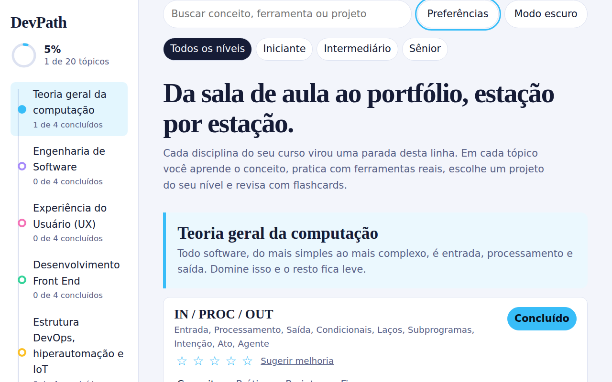
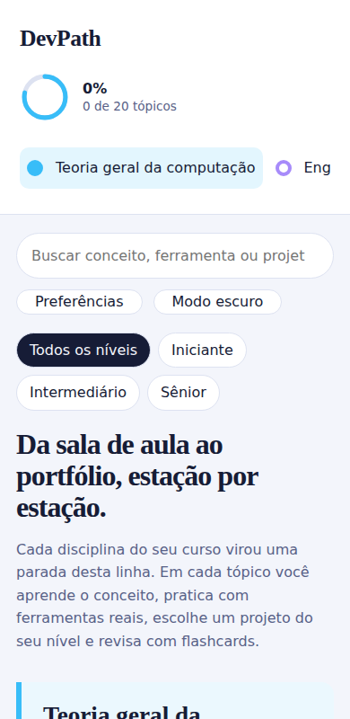

# DevPath · Mapa de estudos de Engenharia de Software


Trilha interativa que transforma as disciplinas do curso em prática. Cada tópico traz **conceito, importância, passo a passo, ferramentas, projetos por nível (iniciante, intermediário, sênior) e flashcards**. O progresso fica salvo no navegador.

**Site:** https://rafael-enginner.github.io/DevPath/





## Destaques
- Navegação em formato de linha de metrô: cada disciplina é uma estação.
- Conteúdo separado da lógica: para criar ou editar tópicos, altere só `js/data.js`.
- JavaScript em módulos ES, componentes pequenos e templates com escape automático (sem risco de XSS).
- Acessibilidade: abas com setas, Home e End, foco visível, link de pular conteúdo, região de status para leitores de tela, `prefers-reduced-motion`.
- Busca instantânea, tema claro e escuro, progresso persistente.
- Testes (`node:test`), ESLint, Prettier e CI no GitHub Actions. Sem dependências em produção.

## Estrutura
```
├── index.html            # estrutura semântica
├── css/styles.css        # tokens, base, layout, componentes, responsivo
├── js/
│   ├── data.js           # conteúdo (módulos e tópicos)
│   ├── catalog.js        # enriquece os dados e faz a busca
│   ├── components.js     # funções que geram o HTML
│   ├── html.js           # template tag com escape
│   ├── tabs.js · theme.js · storage.js · config.js
│   └── main.js           # estado, eventos e renderização
├── assets/               # imagens, ícones e capturas de tela
├── docs/adr/             # decisões de arquitetura
├── tests/                # unitários (node:test) e e2e (Playwright)
└── .github/workflows/ci.yml
```

## Fonte personalizada (opcional)
O visual usa fontes do sistema. Para ativar a Geist, baixe `Geist-Variable.woff2`, coloque em `assets/fonts/` e descomente o bloco `@font-face` no início de `css/styles.css`. A política de segurança só aceita fontes do próprio site.

## Rodar localmente
Módulos ES não abrem com duplo clique em `index.html`. Use um servidor local:
```bash
npm start            # ou: npx serve .
```

## Qualidade
```bash
npm install
npm run format       # formata com Prettier
npm run check        # ESLint + testes unitários
npm run test:e2e     # testes de navegador (Playwright + axe)
```

## Segurança
Veja [SECURITY.md](SECURITY.md) para reportar vulnerabilidades e conhecer as medidas adotadas.

## Licença
MIT.


## Biblioteca de conhecimento (opcional)

O DevPath inclui uma implementação inicial da biblioteca de PDFs com Supabase e geração de conteúdo via Gemini API. Para configurar banco, autenticação, upload privado, funções de backend e publicação revisada, siga [`docs/BIBLIOTECA-IA.md`](docs/BIBLIOTECA-IA.md). A integração fica desativada até preencher `SUPABASE_URL` e `SUPABASE_ANON_KEY` em `js/config.js` e implantar as funções.
